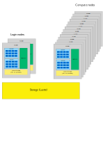

# Brief introduction to HPC environments {.title}

<small>
All material (C) 2020-2021 by CSC -IT Center for Science Ltd. and the authors.
This work is licensed under a **Creative Commons Attribution-NonCommercial-ShareAlike** 3.0
Unported License, [http://creativecommons.org/licenses/by-nc-sa/3.0/](http://creativecommons.org/licenses/by-nc-sa/3.0/)
</small>

# Some notes on vocabulary

Roughly you can think of

- computer ~= node
- processor ~= socket
- core~= CPU

{width=60%} 

# Cluster systems

- Login nodes are used to set up jobs (and to launch them)
- Jobs are run in the compute nodes
- A batch job system (aka scheduler) is used to run and manage the jobs
  - On CSC machines we use Slurm
  - Other common systems include SGE and Torque/PBS
  - Syntax is different, but basic operation is similar

{width=80%} 

# Planning jobs
- What kind of recources can your application use?
  - Can it use more than one core?
  - How much memory it will need?
  - Can it use GPU?
- See what kind of resources are available
  - Each system is different, so check the documentation
- What takes long (is the time limiting part) in your job?

# Things to check
- What kind of nodes are available?
  - Number of cores
  - Size of memory
  - Extra hardware, *e.g.* GPU, fast local storage
- What partitions (queues) are available
  - Job sizes, max run time, etc
  - Provisioning policy
      - Per core/per node/other

# Available HPC resources

- [Puhti](https://docs.csc.fi/computing/systems-puhti/) is the general purpose supercomputer ☑️
- [Mahti](https://docs.csc.fi/computing/systems-mahti/) is the massively parallel flagship supercomputer
- [Pouta](https://docs.csc.fi/cloud/pouta/pouta-what-is/) provides cloud resources via OpenStack (Iaas)
- [Rahti](https://docs.csc.fi/cloud/rahti/rahti-what-is/) provides containers via okd (Paas)
- [Allas](https://docs.csc.fi/data/Allas/) provides object storage for all services

# Quick and dirty comparison of Puhti and Mahti

|                             | Puhti  | Mahti    |
| --------------------------- |------- | ----     | 
| Number of preinstalled applications   | [123+](https://docs.csc.fi/apps/by_system/#puhti)   | [16+](https://docs.csc.fi/apps/by_system/#mahti)       | 
| Cores per node              | 40     | 128       |
| Job size (min-max) cores    | 1-1040 | 128-25600 |
| Memory per node (GiB)       | 192-1536 | 256     |
| GPU cards                   | 120 x V100 | 96 x A100|
| Fast node local disk (NVMe) | 120   | (24 GPU nodes)  |

In short: Mahti is for much larger parallel jobs, prepare to install and optimize your code.
(Still, a Puhti *node* is > 10x your laptop.)
