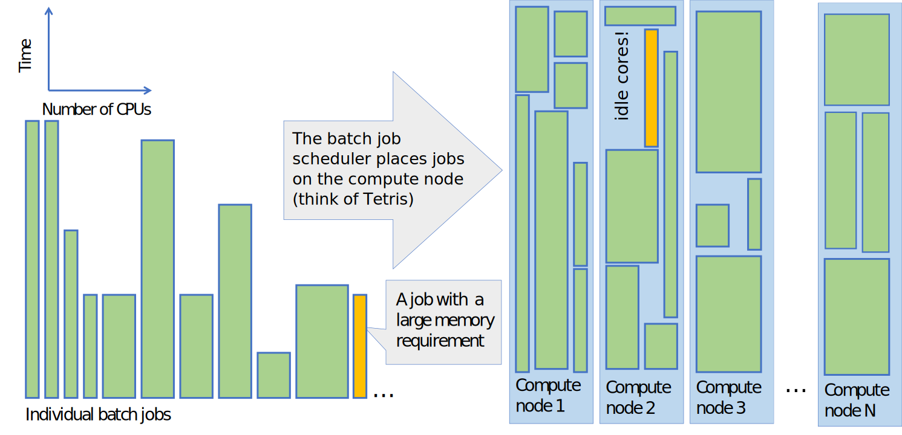
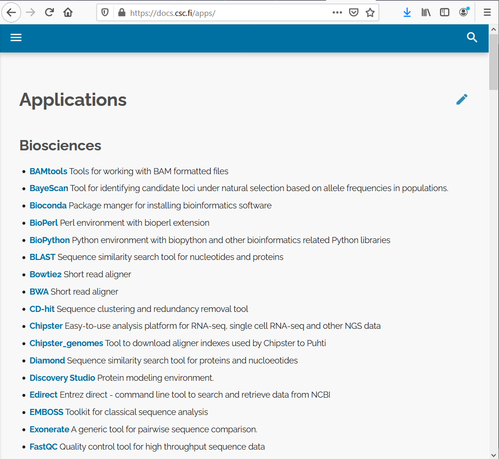

# The batch job system in CSC's HPC environment {.title}

<div class="column">

</div>
<div class="column">
<small>
All material (C) 2020-2021 by CSC -IT Center for Science Ltd.
This work is licensed under a **Creative Commons Attribution-ShareAlike** 4.0
Unported License, [http://creativecommons.org/licenses/by-sa/4.0/](http://creativecommons.org/licenses/by-sa/4.0/)
</small>
</div>

# What is a batch job? 1/2
- On a laptop we are used to start a program (job) by clicking on an icon and the job starts instantly
- If we start many jobs at the same time we occasionally run into problems like running out of memory _etc._
- In an HPC environment the computer is shared among hundreds of other users who all have different resource needs
- HPC batch jobs include an **estimate (requirement) on how much resources they are expected to use**

# What is a batch job? 2/2
- A batch job consists of two parts: A resource request and the actual computing step
- A job is not started directly, but is sent into a **queue**
- Depending on the requested resources and load, the job may need to wait to get started
- At CSC (and HPC systems in general) all heavy computing must be done via batch jobs (see [Usage policy](https://docs.csc.fi/computing/overview/#usage-policy))

# What is a batch job system?
- A resource management system that keeps track of all batch jobs that use, or would like to use the computing resources
- Aims to share the resources in an efficient and fair way
- Optimizes resource usage by filling the compute node with most suitable jobs

# Queueing and fair share of resources
- A job is queued and starts when the requested resources become available
- The order in which the queued jobs start depends on their priority and available resources
- At CSC the priority is configured to use "fair share"
   - The _initial_ priority of a job _decreases_ if the user has recently run lots of jobs
   - Over time (while queueing) its priority _increases_ and eventually it will run
   - Some queues have a lower priority (like _longrun_ -- use shorter if you can!)
- See our main documentation on [Getting started with running jobs](https://docs.csc.fi/computing/running/getting-started/) section in docs.csc.fi

# Schema on how the batch job scheduler works


# The batch job system in CSC's HPC environment 
- CSC uses a batch job system [(SLURM)](https://slurm.schedmd.com/sbatch.html) to manage jobs 
- SLURM is used to control how the overall computing resources are shared among all projects in an efficient and fair way
- SLURM controls how a single job request gets resources, like:
    - computing time
    - number of cores
    - amount of memory
    - other resources like gpu, local disk, *etc.*

# Example serial batch job script for Puhti

- A batch job is a shell script (bash) that consists of two parts:
   - A resource request flagged with `#SBATCH` and the actual computing step(s)

```text
#!/bin/bash
#SBATCH --job-name=print_hostname     # Defines the job name shown in the queue.
#SBATCH --time=00:01:00               # Defines the max time the job can run.
#SBATCH --partition=test              # Defines the queue in which to run the job.
#SBATCH --ntasks=1                    # Defines the number of tasks.
#SBATCH --cpus-per-task=1             # Number of cores is ntasks * cpus-per-task.
#SBATCH --account=project_20001234    # Defines the billing project. Mandatory field.

srun echo "Hello $USER! You are on node $HOSTNAME"
```
- The options have been described in [Create batch jobs for Puhti](https://docs.csc.fi/computing/running/creating-job-scripts-puhti/)
   - The actual _program_ is launched using the `srun` command
   - The content above could be copied into a file like `simple_serial.bash` and put into the queue with the command `sbatch simple_serial.bash`

# Use an application specific batch script template

<div class="column">

- The [application list in docs](https://docs.csc.fi/apps/) contains example scripts for some software
- Use these as the *starting point* for your own scripts
- They have been tested and optimized (although for minimal resources) for *that* application
   - Consult the manual or other examples to adapt to your own needs
</div>
<div class="column">

{width=90%}
</div>

# Submitting, cancelling and stats of batch jobs
- The job script file is submitted with the command:
   - `sbatch example_job.sh`
- List all your jobs that are queuing/running:
   - `squeue -u $USER`
- Detailed info of a queuing/running job:
   - `scontrol show job <jobid>`
- A job can be deleted using the command:
   - `scancel <jobid>`
- Display the used resources of a completed job:
   - `seff <jobid>`
 
# Available batch job partitions

- [The available batch job partitions](https://docs.csc.fi/computing/running/batch-job-partitions/) are listed in docs.csc.fi
- In order to use the resources in an efficient way, it is important to estimate the request as accurately as possible
- By avoiding an excessive "just-in-case" requests, the job will start earlier

# Different type of HPC jobs 1/2

- Typically an HPC job can be classified as serial, parallel or GPU, depending on the main requested resource 
- The following slides will provide you with an overview of different job types
- A serial job is the simplest type of job whereas parallel and GPU-jobs may require some advanced methods to fully utilise their capacity
- If you use already installed software be sure to study if it needs resources for serial, parallel or GPU jobs

# HPC serial jobs

- A serial software can only use one core, so don't reserve more!
- Why could your serial job benefit from being executed using CSC's resources instead of on your own computer? 

    - Part of a larger workflow
    - Avoid data transfer between CSC and your own computer
    - Data sharing among other project members
    - CSC's software licensing
    - It was already installed
    - Memory and/or disk demands

# Running multiple serial jobs
- You can utilize parallel resources for running multiple serial jobs at the same time
    - [Array jobs](https://docs.csc.fi/computing/running/array-jobs/) 
    - [GREASY jobs](https://docs.csc.fi/computing/running/greasy/)
    - ... and lots of ther workflow tools or DIY scripts
- Pure serial resources are only available in Puhti, but GREASY jobs can make serial jobs suitable for Mahti, too
    - **But**, your workflow needs to fill (at least) one Mahti node and keep the CPUs busy for the job duration to be efficient use of resources
 
# HPC parallel jobs

- A parallel job distributes the calculation over several cores in order to achieve a shorter wall time (and/or a larger allocatable memory)   
- There are two major parallelization schemes: [OpenMP](https://en.wikipedia.org/wiki/OpenMP) and [MPI](https://en.wikipedia.org/wiki/Message_Passing_Interface)
   - Note, depending on the parallellization scheme there is a slight difference between _how_ the resource reservation is done  
- Batch job script [how-to create](https://docs.csc.fi/computing/running/creating-job-scripts-puhti/) and [examples](https://docs.csc.fi/computing/running/example-job-scripts-puhti/) for Puhti
- Batch job script [how-to create](https://docs.csc.fi/computing/running/creating-job-scripts-mahti/) and [examples](https://docs.csc.fi/computing/running/example-job-scripts-mahti/) for Mahti
- **The best starting point:** [Software specific batch scripts in docs](https://docs.csc.fi/apps/)

# HPC GPU jobs 

- A graphics processing unit (GPU, a video card), is capable of doing certain type of simultaneous calculations very efficiently
- In order to take advantage of this power, a computer program must be reprogrammed to adapt on how GPU handles data   
- CSC's GPU resources are relatively scarce and hence should be used with [particular care](https://docs.csc.fi/computing/overview/#gpu-nodes)
    - A GPU uses 60 times more billing units than a single CPU core - see above for performance requirements
    - In practice, 1-10 CPU cores (but not more) should be allocated per GPU on Puhti

# Interactive jobs

- When you login to CSC's supercomputers, you end up in one of the login nodes of the computer
    - These login nodes are shared by all users and they are [not intended for heavy computing.](https://docs.csc.fi/computing/overview/#usage-policy)
- If you have a heavier job that still requires interactive response (_e.g._ a graphical user interface)
    - Allocate the resource via the the [interactive partition](https://docs.csc.fi/computing/running/interactive-usage/)
    - This way your work is performed in a compute node, not on the login node
